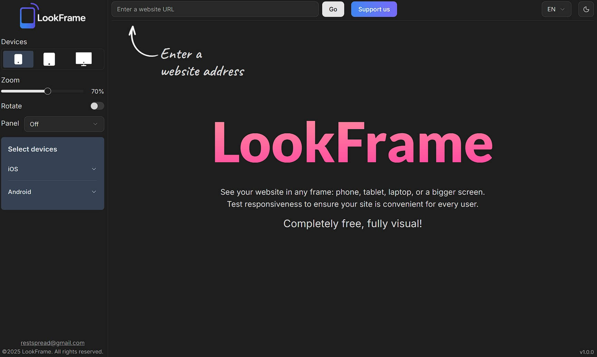
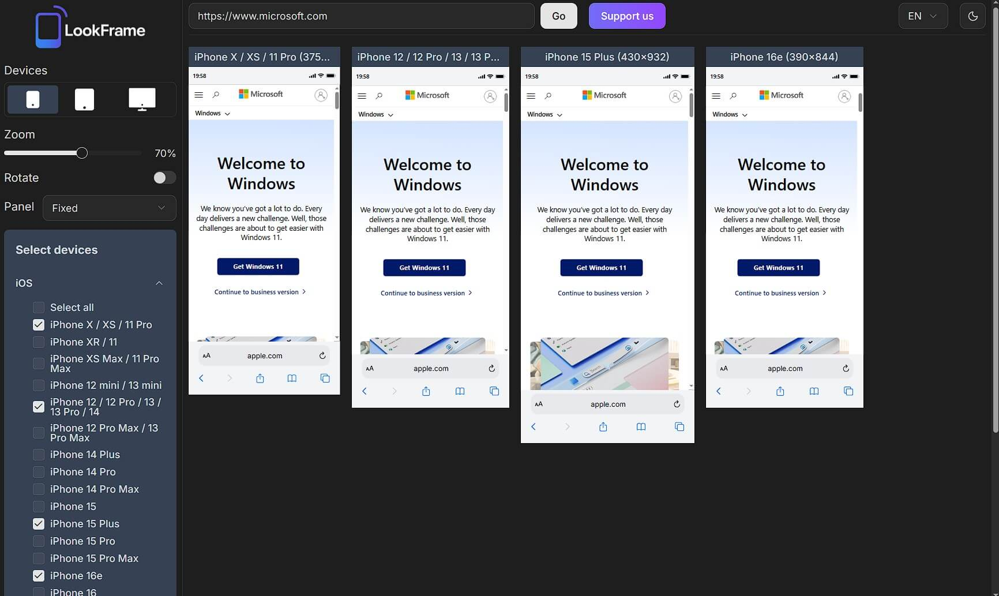

<h1>
  
  LookFrame
</h1>

**LookFrame** is a sleek online tool to preview websites on different screen sizes and devices, making responsive design effortless.  
It supports **light & dark themes**, **multiple languages**, and provides an intuitive, fast interface for designers and developers alike.

Built with **Next.js, React, TailwindCSS, and Radix UI**, it’s fully modern, extensible, and ready for any workflow.

🌐 Try it here: [https://www.look-frame.com](https://www.look-frame.com)

---

